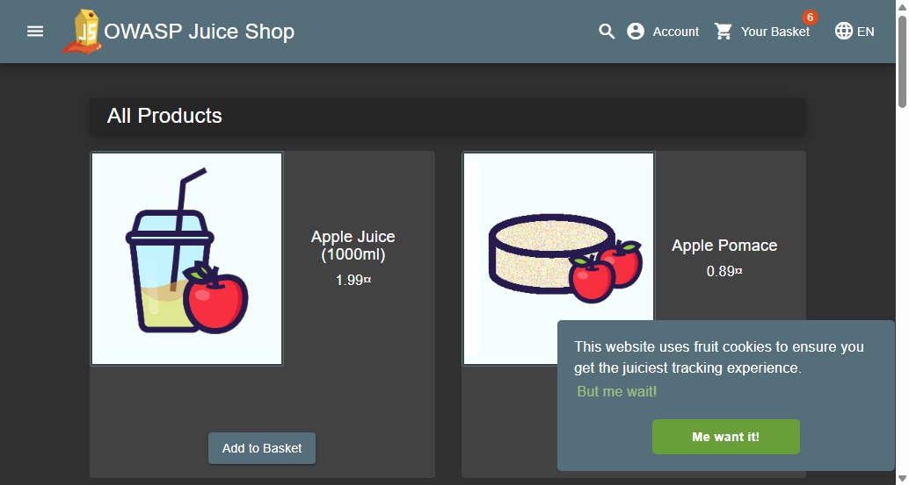
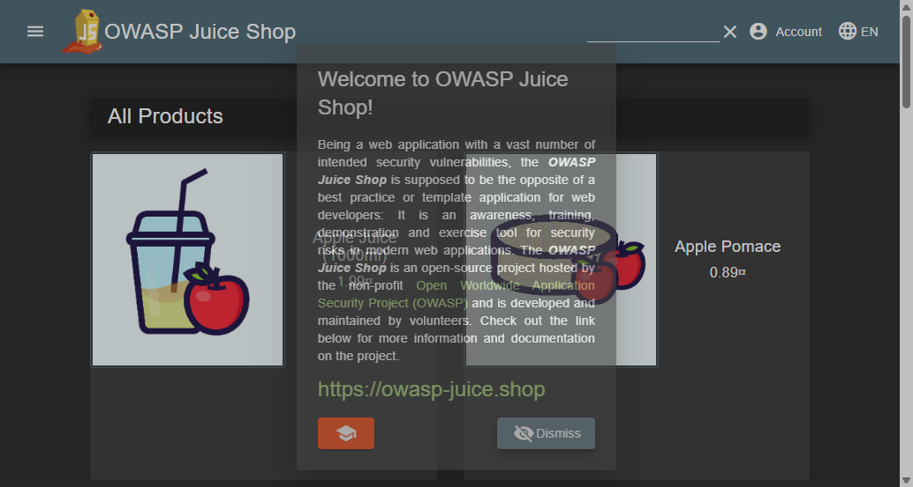

# Web Security Automation Framework (WSAF)
## Automated Security Testing Framework (DAST)

A dynamic web application security testing framework that automates vulnerability verification for OWASP Top 10 flaws—focusing on **Reflected Cross-Site Scripting (XSS)** and **Authentication Brute-Force/Weak Credentials**—using **Python**, **pytest**, and **Selenium WebDriver** with optional **OWASP ZAP** proxy inspection.

---

## Visual Reports & Test Artifacts

### 1. Vulnerability Execution Evidence

<p align="center">
  
  
</p>

* **Left:** Successful brute-force exploit demonstrating authentication bypass using weak credentials (`admin123`).
* **Right:** Captured screenshot evidence during automated XSS fuzzing detection.

---

## System Architecture

Built on the **Page Object Model (POM)** to decouple low-level browser interaction from security test logic:

```text
                        +----------------------------+
                        |       pytest Engine        |
                        +--------------+-------------+
                                       |
                   +-------------------+-------------------+
                   |                                       |
                   v                                       v
         +-------------------+                   +-------------------+
         |   test_auth.py    |                   |    test_xss.py    |
         +---------+---------+                   +---------+---------+
                   |                                       |
                   +-------------------+-------------------+
                                       |
                                       v
                       +-------------------------------+
                       |   Page Object Model (POM)     |
                       |    (LoginPage / SearchPage)   |
                       +---------------+---------------+
                                       |
                                       v
                       +-------------------------------+
                       |      Selenium WebDriver       |
                       |    (Chrome Headless / GUI)    |
                       +---------------+---------------+
                                       |
                                [HTTP / HTTPS]
                                       |
                                       v
                     +-----------------------------------+
                     |      OWASP ZAP Proxy Listener     |
                     |         (127.0.0.1:8080)          |
                     +-----------------+-----------------+
                                       |
                                [Forward Traffic]
                                       |
                                       v
                     +-----------------------------------+
                     |      Target Web Application       |
                     |      (e.g., OWASP Juice Shop)     |
                     +-----------------------------------+
